# Cherry Leaf Mildew Detector

The Cherry Leaf Mildew Detector is a Machine Learning image analysis system to predict the presence of
powdery mildew on cherry tree leaves. It has been developed for Farmy & Foods, an agricultural company who are facing challenges with their cherry plantations presenting powdery mildew - a fungal disease that affects a wide range of plants.

View the live version of the app [here](https://kk-mildew-detector.herokuapp.com/)

## Dataset Content

The dataset is sourced from [Kaggle](https://www.kaggle.com/codeinstitute/cherry-leaves) and contains 4208 images of cherry leaves, split into two folders:

- 2104 healthy cherry leaf images
- 2104 powdery mildew infected cherry leaf images

## Business Requirements

The cherry plantation crop from Farmy & Foods is facing a challenge where their cherry plantations have been presenting powdery mildew. Currently, the process is manual verification if a given cherry tree contains powdery mildew. An employee spends around 30 minutes in each tree, taking a few samples of tree leaves and verifying visually if the leaf tree is healthy or has powdery mildew. If there is powdery mildew, the employee applies a specific compound to kill the fungus. The time spent applying this compound is 1 minute. The company has thousands of cherry trees, located on multiple farms across the country. As a result, this manual process is not scalable due to the time spent in the manual process inspection.

To save time in this process, the IT team suggested an ML system that detects instantly, using a leaf tree image, if it is healthy or has powdery mildew. A similar manual process is in place for other crops for detecting pests, and if this initiative is successful, there is a realistic chance to replicate this project for all other crops. The dataset is a collection of cherry leaf images provided by Farmy & Foods, taken from their crops.

1. The client is interested in conducting a study to visually differentiate a healthy cherry leaf from one with powdery mildew.
2. The client is interested in predicting if a cherry leaf is healthy or contains powdery mildew.

## Hypothesis and how to validate?

### **Hypothesis 1**

We suspect cherry leaves infected with powdery mildew have clear marks/signs, that can visually differentiate, from a healthy leaf.

### **Hypothesis 1 - Validation**

By computing the average images for healthy and powdery mildew infected cherry leaves and displaying a comparison, we can visually check for differences in the leaves.
Creating an image montage provides further visualisation of healthy and infected cherry leaves.
Although images in the montage and the average variability and
difference of the two images do present visual distinctions - infected leaves have more white stripes across the center of the leaf whereas healthy ones are a more opaque green - when plotting the difference image of the two we notice no patterns where we could intuitively differentiate one from another.

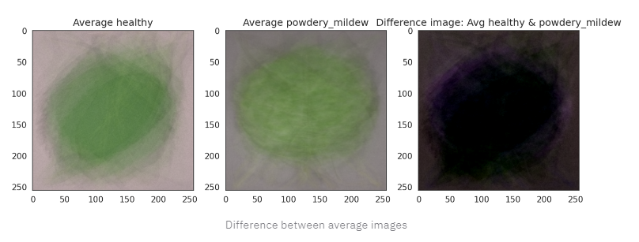

### **Hypothesis 2**

We suspect that an image classification model can be used to predict whether a leaf in a given image is healthy or infected with powdery mildew.

### **Hypothesis 2 - Validation**

By training the image classification model using multi-class classification and a portion of the dataset we are able to predict the health of one or more leaf images at a time with 93% accuracy on the tested data set.

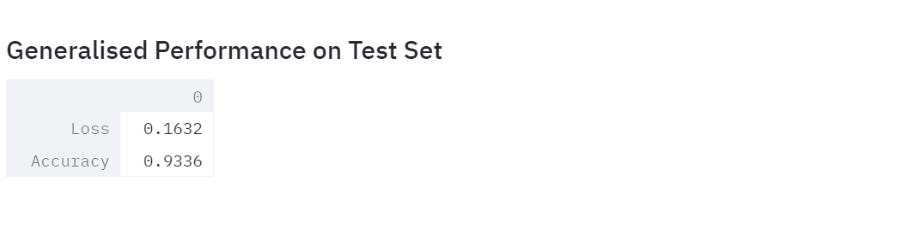

### **Hypothesis 3**

We suspect that reducing the size of the images in the dataset will allow the model to train faster without compromising the accuracy of prediction to an unsatisfactory level.

### **Hypothesis 3 - Validation**

Resizing the images in the dataset from 256 x 256 pixels to 100 x 100 pixels allowed the model to train over 80% faster, completing each epoch in approximately 40 seconds as opposed to approximately 240 seconds with the original image size. However, the quality of the images was compromised and the model was overfitting, which hinders the accuracy of prediction on unseen data. Due to this, the model was trained with images at the original 256 x 256 pixels size.

## The rationale to map the business requirements to the Data Visualisations and ML tasks

### Business Requirement 1 - Data Visualization

**User Stories**

- As a client, I want a dashboard I can navigate intuitively so that I can find and view the study and image display.
- As a client, I want to view the average image and variability for healthy and powdery mildew infected leaves in the dataset so that I can understand their distinctions.
- As a client, I want to view the difference between the average image of a healthy leaf and of an infected one so that I can understand if their is a noticeable difference between the two.
- As a client, I want to view an image montage of healthy and infected leaf images in the dataset so that I can view the visual differences between the two.

**Implementation**

- Streamlit was used to create a client dashboard comprising of 6 pages and a collapsible menu for intuitive navigation.
- By using TensorFlow to load the dataset images into an array in the Data Visualization notebook, the average and variability for all images is displayed and can be found on the Leaf Visualizer page of the live App.
- By calculating the mean for the healthy and infected average images, the difference between the two can be visualized and found on the Leaf Visualizer page of the live App.
- Also found on the Leaf Visualizer page, users have the ability to create an image montage of healthy or infected cherry leaf images.

### Business Requirement 2 - Image Prediction

**User Stories**

- As a client, I want an image classification machine learning model with an accuracy of at least 85%, to predict whether a given image of a leaf is healthy or infected, so that I can identify which plants require fungicide treatment.
- As a client, I want to upload multiple images for prediction at once so that I can quickly identify which plants require fungicide treatment.
- As a client, I want the probability metrics to be visibly displayed so that I can understand the accuracy of the prediction.
- As a client, I want to download a report of the prediction so that I can save it locally for easy access at a later date.
- As a client, I want to view the performance metrics of the image classification model so that I can further understand it's accuracy levels.

**Implementation**

- The image classification model was created in the Modelling and Evaluation notebook and when evaluated on the test dataset returns an accuracy level of 93%.
  By uploading an image of a leaf the client will receive an instant diagnostic on the leaf's health.
- The upload widget, which can be found on the Mildew Detector page of the live App, accepts multiple images at once up to a size of 200MB.
- Alongside the prediction, the probability metrics are displayed in an interactive bar chart which provides the percentage likelihood of the leaf belonging to each label (healthy or unhealthy).
- Once a prediction has been generated, the client has the option to download the report and save locally via the "Download Report" link on the Mildew Detector page.
- Using Pandas, Seaborn, Matplotlib and ScikitLearn, information on dataset distribution and the performance of the model is plotted and displayed on the ML Performance Metrics page of the live App.

## ML Business Case

- We want a ML model to predict if a cherry lead is infected with powdery mildew or not, based on image data provided by the client. It is a supervised model, a multi-class(2), single-label, classification model.
- Our ideal outcome is provide Farmy & Foods with a faster and reliable diagnostic on if a given leaf is infected or not with powdery mildew.
- The model success metrics are:
  - Accuracy of 85% or above on the test set.
- The model output is defined as a flag, indicating if the leaf is infected with powdery mildew or not and the associated probability of being infected or not. Farmy & Foods employees will take photos of the leaves and upload them to the App. The prediction is made on the fly (not in batches).
- Heuristics: The current diagnostic requires a manual process inspection which takes around 30 minutes per tree, taking a few samples of tree leaves and verifying visually if the leaf tree is healthy or has powdery mildew. This process is costly due to the time taken in manual inspection and leaves room to produce inaccurate diagnostics due to human errors.
- The training data to fit the model was provided by the client, Farmy & Foods and is available on [Kaggle](https://www.kaggle.com/codeinstitute/cherry-leaves). This dataset contains 4208 images, 2104 healthy leaf images and 2104 infected ones divided into their respective subfolders.

## Model Creation

For the model, a Convolutional Neural Network (CNN) was used to address the requirement of an image classification system.

It consists of:

- **Batch Size**: the batch size was initially set to 32 as this is the general rule of thumb, however this presented overfitting so the final model trained on a reduced batch size of 16
- **2D convolutional layers**: most commonly used for spatial convolution over images
- **Pooling layers**: placed after each Conv2D layer, these create down sampled feature maps which provide a summarized version of the features detected in the input
- **Dense Layer**: The model was initially trained with 128 nodes in the dense layer, however too many nodes can result in overfitting as was observed in this case. To reduce the risk of overfitting, the final model trained with 64 nodes in the dense layer.
- **Dropout Rate**: after selecting Adagrad as the optimizer, the dropout rate was lowered to 0.2 to prevent the model underfitting.
- **Activation**: the model was first trained using Sigmoid for binary classification before switching to Softmax for multi-class (2) classification. This allows for display of probability metrics to the client alongside the diagnostic prediction
- **Optimizer**: the model was initially trained using Adam as an optimizer, however this resulted in overfitting despite a high dropout rate of 0.5. The final iteration of the model uses Adagrad which shows a normal learning rate when comparing the accuracy and loss of the train and validation datasets.

### Model Iterations

The model underwent multiple iterations in order to ascertain the best batch size, number of filters in each layer, number of nodes, dropout rate, activation and optimizer.

The first iteration, with a batch size of 32, 128 nodes in the dense layer, Sigmoid as the activation, Adam for the optimizer and a 0.5 dropout rate, when evaluated with a classification report, shows results which look to good to be true, indicating the model is overfitting.

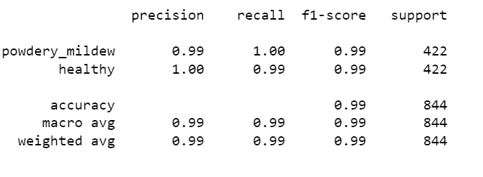

After a number of iterations in which one of batch size, nodes in dense layer, activation function or optimizer were altered for comparison to the first model version, changing the optimizer to Adagrad helped the model avoid overfitting most significantly alongside reducing batch size and number of nodes. Using Softmax also allowed for faster model training time per epoch, however, the precision metric for powdery mildew infected leaves was quite low at 89%. To remedy this, the dropout rate for the final model version was lessened to 0.2.

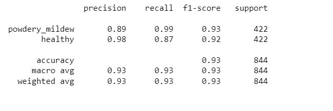

## Dashboard Design

The Mildew Detector dashboard follows the same structure as the Malaria Detector for the Code Institute Walkthrough Project 1. It consists of 6 pages, accessible via a collapsible menu on the top left of the webpage.

- **Project Summary**

The Project Summary page provides some general information on powdery mildew and its effect on plants, as well as a description of the dataset content and the client's business requirements.

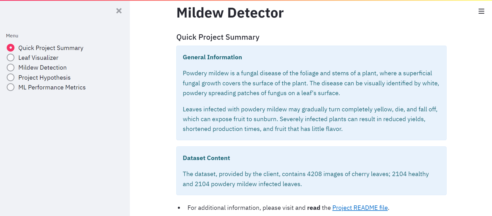

- **Leaf Visualizer**

The Leaf Visualizer page answers business requirement 1 and is made up of three sections. The output for each section is displayed when a user clicks on the checkbox next to it.

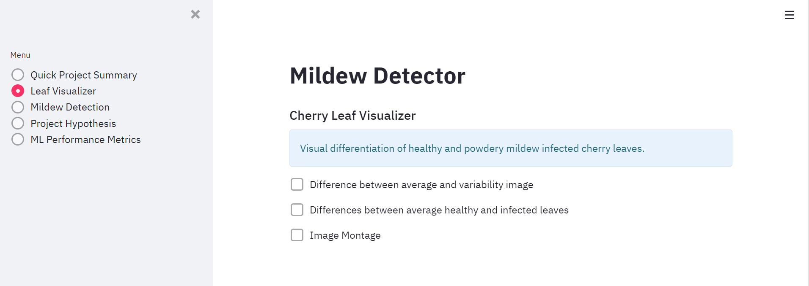

1. The average and variability of healthy and infected leaf images from the dataset
   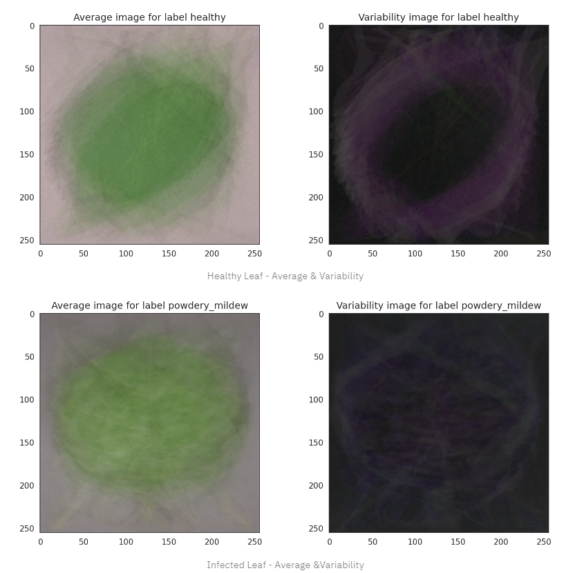

2. The difference in average images of healthy and infected leaf images
   

3. An image montage of healthy or infected leaves
   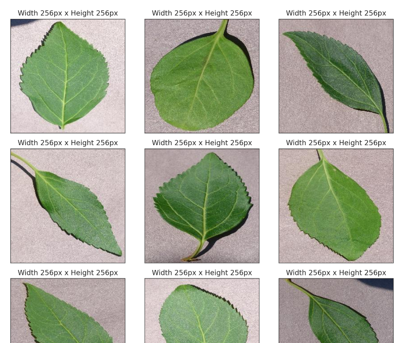
   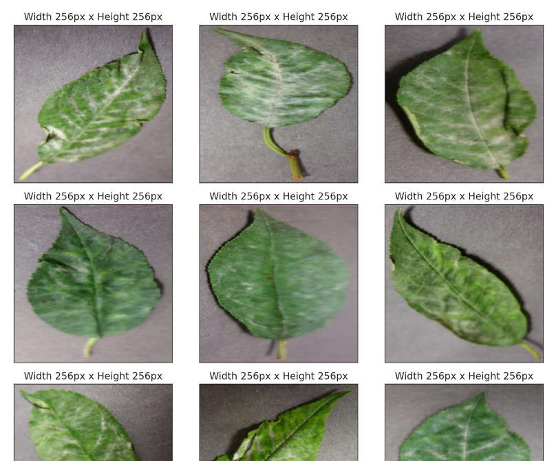

- **Mildew Detection**

The Mildew Detection page answers business requirement 2. There is an upload widget which allows users to upload up to 200MB of leaf images at a time in a JPG format for prediction.
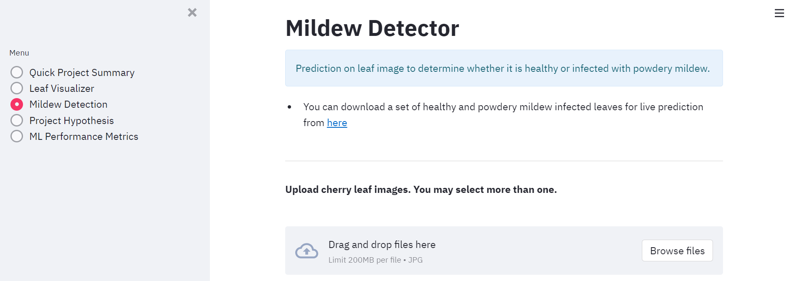

Once the image is uploaded the user will receive an instant prediction, along with probability metrics and a link to download the report.
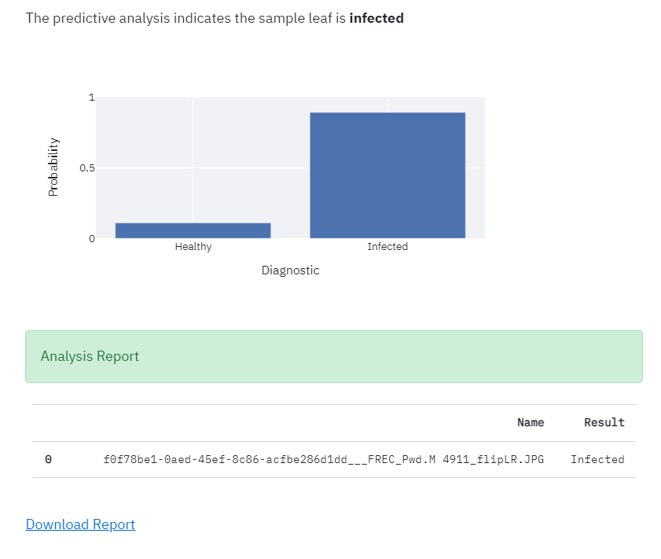

- **Project Hypotheses**

The Project Hypothesis page provides detailed information on the three hypotheses which were considered in the development of the project, and how these were validated.
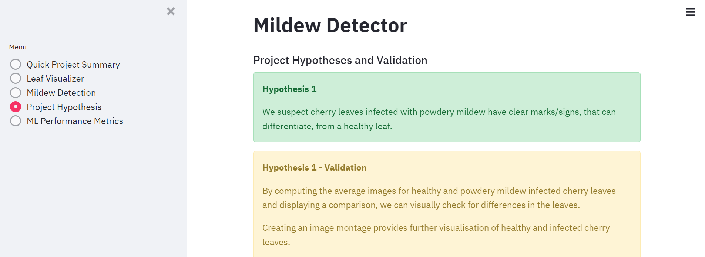

- **ML Performance Metrics**

The ML Performance Metrics page provides a detailed analysis of the distribution of data and performance of the model.

1. Bar chart of data distribution across train, validation and test sets
   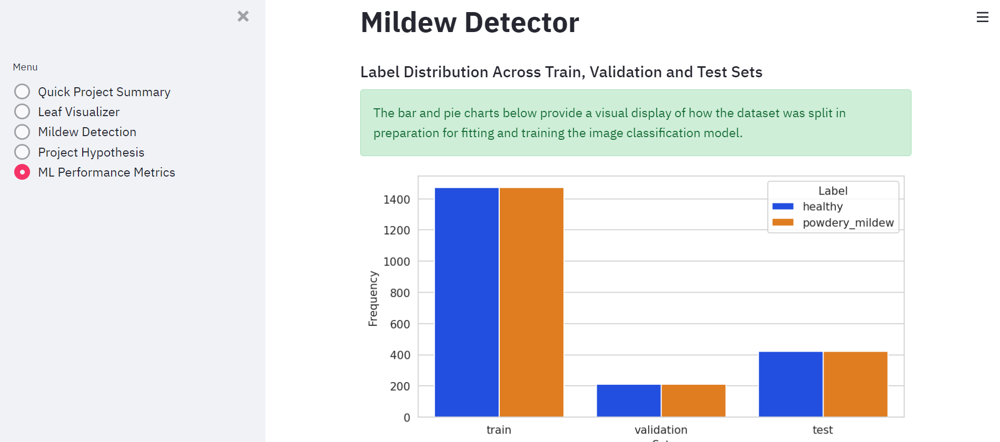

2. Pie chart of data distribution across train, validation and test sets
   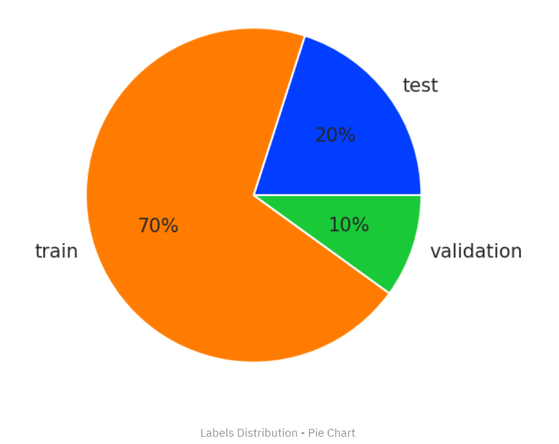

3. Confusion matrix to display true and false positive and negative predictions for both healthy and infected leaves
   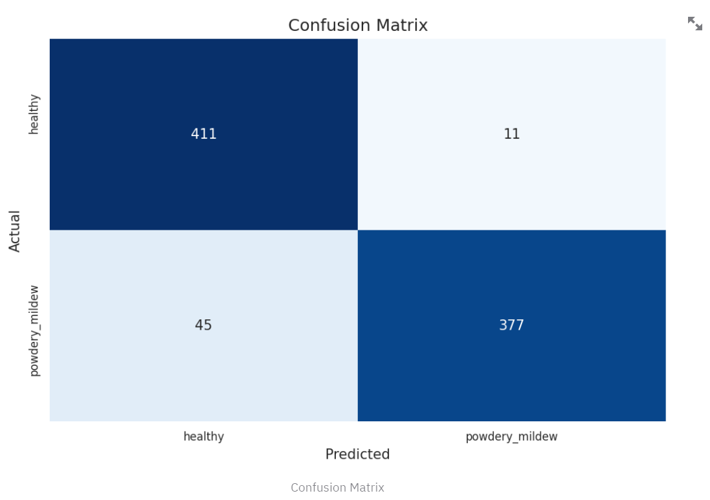

4. Model learning curves for accuracy and loss of training vs validation data
   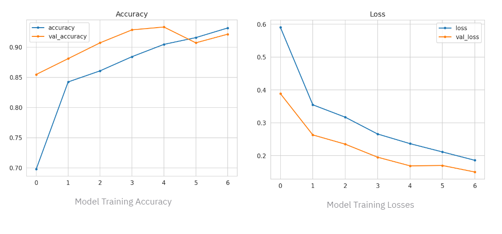

5. Evaluation of the model against the test dataset
   

## Bugs

### Fixed

When using the trained model to predict on new data, the result would consistently be the opposite of what it should at a very high accuracy, leading me to believe the model was working correctly but the labels had somehow switched around. This was due to the target map number having not been updated from [0] to [1] in the "Predict class probabilities" code at the end of the Modelling and Evaluation notebook when switching from binary classification with Sigmoid to multi-class classification with Softmax

### Unfixed

There are no remaining unfixed bugs I am aware of.

## Deployment

### Heroku

The App live link is: https://kk-mildew-detector.herokuapp.com/

The project was deployed to Heroku using the following steps.

1. Log in to your Heroku account in the Command Line Interface(CLI) of your chosen IDE
2. Set the runtime.txt Python version to a [Heroku-20](https://devcenter.heroku.com/articles/python-support#supported-runtimes)
3. Visit the Heroku webpage and log in to your account
4. Click the "New" button to create a new app and name it
5. Navigate to the Deploy tab and select GitHub as the deployment method
6. Search for your repository name and click Search
7. Once it is found, click Connect
8. Select the branch you want to deploy, then click Deploy Branch
9. The deployment process should happen smoothly if all deployment files are fully functional.
10. Once completed click the button Open App on the top of the page to access your App
11. If the slug size is too large then add large files not required for the App to the .slugignore file

### Forking on GitHub

To make a copy of the GitHub repository to use on your own account, you can fork the repository with the following steps:

- On the Github repository [page](https://github.com/katkapsasky/mildew-detector), go to the 'Fork' button on the top right of the page, and click to create a copy of the repository on your own GitHub account.

### Cloning

- On the page for the [repository](https://github.com/katkapsasky/mildew-detector), click the 'Code' button
- To clone the repository using HTTPS, copy the HTTPS URL provided there
- Open your CLI application of choice and change the current working directory to the location where you want the cloned directory to be created.
- Type git clone, and then paste the previously copied URL to create the clone

## Tools & Technologies

### Main Data Analysis and Machine Learning Libraries

- [NumPy](https://numpy.org/) for converting images to an array
- [Pandas](https://pandas.pydata.org/) for creating dataframes
- [Seaborn](https://seaborn.pydata.org/) for data visualization
- [Matplotlib](https://matplotlib.org/) for data visualization
- [Plotly](https://plotly.com/python/) for data visualization
- [TensorFlow](hhttps://www.tensorflow.org/api_docs) for implementing best practices in data automation, model tracking, performance monitoring
- [Scikit-learn](https://scikit-learn.org/) for image classification

### Platforms

- [Kaggle](https://www.kaggle.com/) for the cherry leaf image dataset
- [GitHub](https://github.com/) for secure onlin code storage
- [Codeanywhere](https://codeanywhere.com/) as a cloud-based IDE for development
- [Jupyter](https://jupyter.org/) for the project's CRISP-DM workflow and development
- [Streamlit](https://streamlit.io/) for the project's development
- [Heroku](https://en.wikipedia.org/wiki/Heroku) for dashboard development

### Languages

- [Python](https://www.python.org/) for the app development
- [Markdown](https://www.markdownguide.org/) for documentation, Jupyter notebooks and dashboard

## Credits

### Content

- [Kaggle - Cherry Leaves Dataset](https://www.kaggle.com/datasets/codeinstitute/cherry-leaves) for data visualization, model training and prediction
- [Wikipedia - Powdery Mildew](https://en.wikipedia.org/wiki/Powdery_mildew) for project summary page on dashboard
- [RHS - Powdery Mildews](https://www.rhs.org.uk/disease/powdery-mildews) for project summary page on dashboard
- [UCIPM - Powdery Mildew on Vegetables](https://en.wikipedia.org/wiki/Powdery_mildew) for project summary page on dashboard
- [Machine Learning Mastery - A Gentle Introduction to Pooling Layers for Convolutional Neural Networks](https://machinelearningmastery.com/pooling-layers-for-convolutional-neural-networks/) for pooling definition in Model Creation section of the ReadMe

### Code

- [Code Institute - Milestone Project Mildew Detection in Cherry Leaves](https://github.com/Code-Institute-Solutions/milestone-project-mildew-detection-in-cherry-leaves) as the template for the project and project ReadMe structure and business requirements
- [Code Institute - Walkthrough Project 1](https://codeinstitute.net/) to structure the project for the Data Visualization, Data Preparation and Modelling and Evaluation notebooks as well as the Streamlit dashboard
- [cla-cif - Cherry Powdery Mildew Detector](https://github.com/cla-cif/Cherry-Powdery-Mildew-Detector) for inspiration on model training and for plotting the confusion matrix in Modelling and Evaluation notebook
- [Towards Data Science - Convolutional Neural Networks, Explained](https://towardsdatascience.com/convolutional-neural-networks-explained-9cc5188c4939) for model fitting and training and explanation in the Model Creation section of the ReadMe
- [Dataaspirant - Difference between Softmax and Sigmoid](https://dataaspirant.com/difference-between-softmax-function-and-sigmoid-function/) for model training in Modelling and Evaluation notebook and for explanation in the Model Creation section of the ReadMe
- [Baeldung - Relation Between Learning Rate and Batch Size](https://www.baeldung.com/cs/learning-rate-batch-size) for determining the best batch size for the model to train with
- [Dataconomy - The touchstone of machine learning: Epoch](https://dataconomy.com/2022/08/19/what-is-an-epoch-in-machine-learning/) for determining the best number of epochs
- [Towards AI - Impact of Optimizers in Image Classifiers](https://towardsai.net/p/l/impact-of-optimizers-in-image-classifiers) for information on the best optimizers to us in model fitting and training
- [Stack Overflow - How to Choose Nodes for Dense Layer](https://stackoverflow.com/questions/62484768/how-to-choose-the-number-of-units-for-the-dense-layer-in-the-convoluted-neural-n) - for determining the best number of nodes for the dense layer of the CNN

## Acknowledgements

- My mentor, Mo Shami, for his continuous support and feedback on the project.
- The Code Institute Slack community, particularly the tutors and students contributing to the #project-portfolio-5-predictive-analytics channel.
